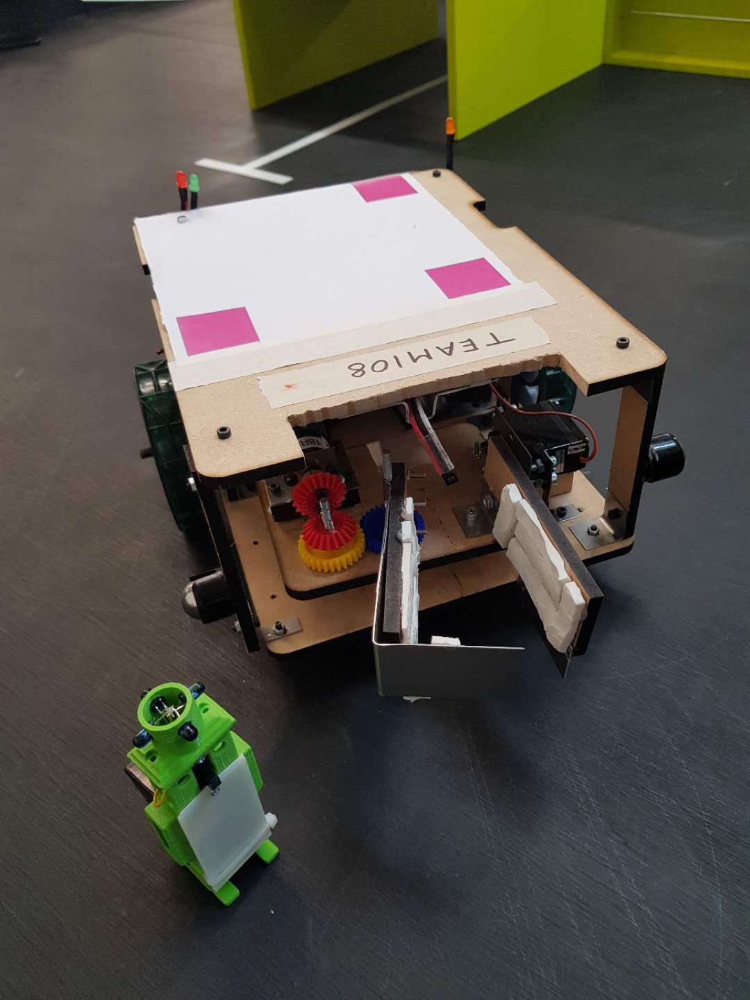
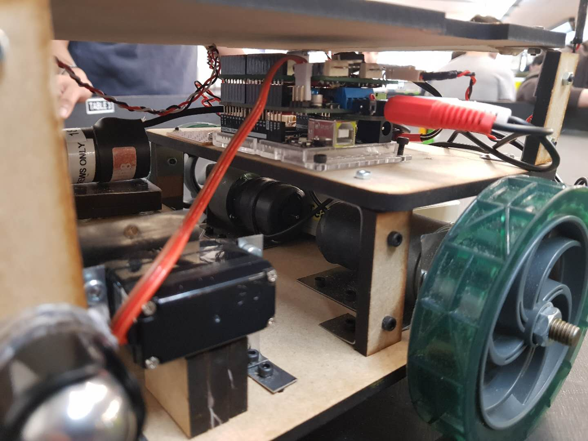
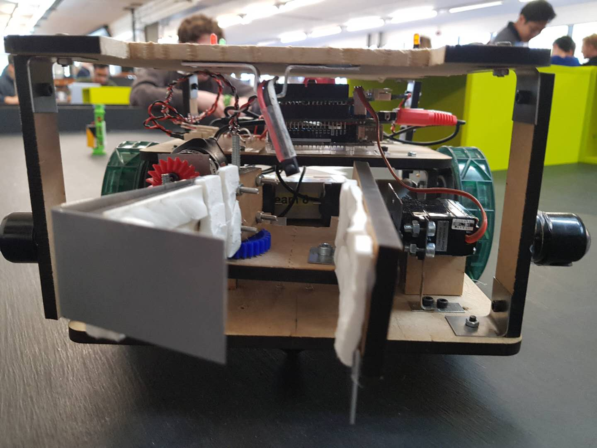

# CV Robot Navigation
Autonomous robot navigation using Computer Vision.



## Arduino

### Wiring



### Pinout

Arduino Wifi Rev 2 is used with the Adafruit motor shield for motor and servo control:

```c++
Adafruit_MotorShield AFMS = Adafruit_MotorShield(); 
```

The pintout for Arduino can ba changed in `arduino/Bin.ino`:

```c++
const int led_abr = 2;
myservo.attach(9);       // attaches the servo on pin 9 to the servo object
```

Servo 2 on the Adafruit sheld corresponds to pin 9 on the Arduino.

### Wifi

The network SSID name and network password need to be specified in `arduino/Bin.ino` for HTTP requests:

```c++
char ssid[] = SECRET_SSID;        // your network SSID (name)
char pass[] = SECRET_PASS;        // your network password (use for WPA, or use as key for WEP)
int keyIndex = 0;                 // your network key Index number (needed only for WEP)
```

## Robot



### Claw

The claw mechanism consists of an electric motor for opening and closing of the claw and a servo for the upward and downward motion.

### Sensors

An Infrared receiver is used for victim health detection and two Optoswitches are used for line-following.

## Python

### Dependencies

Install requests from PyPI:

```sh
sudo pip install requests
```

Install OpenCV from GitHub source.

## Demo

Video demo of the robot can be found on [Youtube channel](https://youtu.be/kYkNHKw41CQ).

### Rescue task

